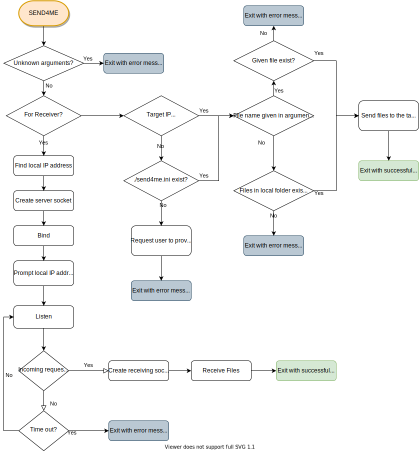

### T1A3 - Terminal Application - Send For Me

# Software Development Plan

## **Purpose**

This App is for computers in a LAN network to send and receive files.

It is quite normal nowadays we have multiple devices in our home network, and we often come across the need to send a certain file from one device to the other. 

Although we have synchronization software such as Dropbox and OneDrive, we still sometimes just need to quickly send files without login or other additional settings. This `send4me` app will serve as sender and receiver, enable two computers to share files in a very simple way.

## **Target Audience**

People who have multiple devices in their home, and who need to share files among these devices.

## **Usage**

1. On the receiving side, put `send4me` into the folder where to receiving file should be saved, run as server:

   `send4me -listen`

   The target IP address would be displayed.

2. On the sending side, specify the target IP address and the file to be sent:

   `send4me -t 192.168.1.106 ./IMG001.jpg`

   Alternatively, just run `send4me` without any parameter, all files in the local directory will be sent to the address that was used last time.

In most cases, we just copy the files that to be sent to the folder where `send4me` is located, and run the `send4me`. This will send all those files to the default target device.

## **Features**

- Server-side
1. Create a server socket and listen on port 4587. Display the server's IP address on the screen.
2. If the client-side connect, create a new socket to receive files. If no connection request in 5 minutes, automatically close the server socket.
3. When the client-side send files, receive those files and save them in the current directory.

- Client-side

1. If `-t` parameter exists in input arguments, use the IP address in input arguments. Otherwise, use the IP address saved in `./send4me.ini` if that file exists. Otherwise, prompt an error message, ask the user to provide a target address.
2. If a filename is given in input arguments, send that file. Otherwise scan and send all files in the local directory.
3. When all files are sent, update `./send4me.ini` if a new IP address was given.

## **User Interaction**

Each time `send4me` runs, it will display a simple help message:

> Send4Me - A simple tool to send and receive files for local computers.

> `send4me -listen` for receiver side

> `send4me -t 192.168.X.X file-to-send.jpg` for sender side

If unknown parameters are given, an error message will display, and the app exits.

If `-listen` parameter is given:

    The APP will display the local IP address if the socket is ready for listening;
    An error message will display if socket cannot be created or cannot listen.

For the sender side, if the target IP address cannot be found, display an error message and the request user to try again. If successfully connected to the target and a socket is established, display a message of "Connected to <192.168.1.101>", otherwise prompt target cannot be reached.

The App will prompt message when:

- Successfully connect to the target computer
- Connect to target computer failed
- Sending one file to the target computer
- All files have been sent successfully

APP will handle below error message 

- Cannot decide the target IP address
- File given in input arguments cannot be found
- No files to be sent
- Connection fail

## **Control Flow Diagram**

