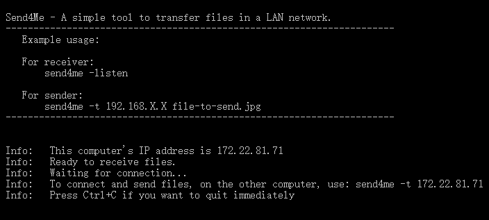
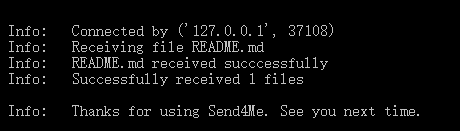
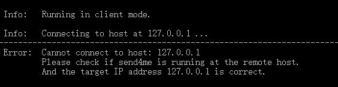
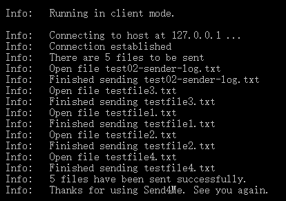
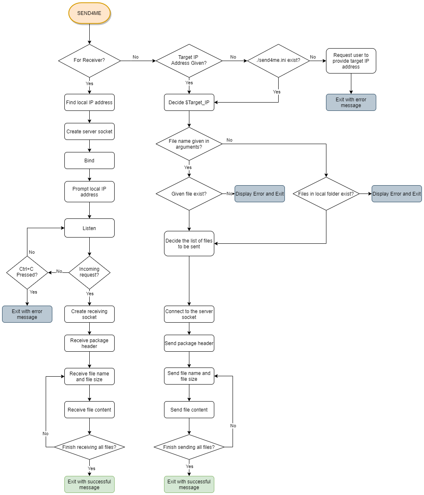

### T1A3 - Terminal Application - Send For Me
---
# Software Development Plan

## **Purpose**

The Send4Me App provides a simple way for computers in a LAN network to exchange files.

Today it is common to have multiple devices in our home network. We often need to send a file from one device to the other. 

Although we have online software such as Dropbox and OneDrive, these solutions require you to have an account and login on both devices. When dealing with huge files, it will take hours before the files are synchronised.

The `send4me` app does not need an account and is not involved with a remote server, files can be transferred directly from one computer to another.

## **Target Audience**

Household and small businesses who have multiple devices, who need to share files between these devices.

## **How to use**

- If you need to receive files, just run Send4Me with "-listen" parameter:

   `send4me -listen`

   It will wait for the client to send files. Received files will be saved in the current directory.

- You can send one or multiple files. 
- You can specify the receiving computer by its IP address. For example:

   `send4me -t 192.168.1.106 IMG001.jpg IMG002.jpg`

   This will send IMG001.jpg and IMG002.jpg to the computer at 192.168.1.106

   * Use "-t" parameter to specify the target computer's IP address
   * You can specify one or more files that need to be sent. If none is given, Send4Me will send all files in the local directory to the target device.

    

3. Just run Send4Me without any parameter. All files in the local directory will be sent to the same computer that was the target last time.

## **Features**

- Analyse input parameters to decide the working mode.

- Server (Receiver):
1. Create a socket and listen on port 9587. Display the server's IP address on the screen. Display an error message if the socket cannot be created or binded.
2. If the client-side connect, create a new socket to receive files. Display an error message if the socket cannot be created.
3. Analyse the header package and decide the number of files that will be sent.
4. Loop to receive files
   - Receive file name and file size
   - Receive file content
   - Save the received file in the current directory. 
   - Display an error message if file transfer is interrupted.
5. Display result

 

- Sender-side

1. If `-t` parameter exists in the input arguments, use the IP address specified. Otherwise, open the `send4me.ini` file and read the IP address from it. If `send4me.ini` does not exist, prompt an error message, asking the user to provide a target IP address.
2. Create a socket and connect to the server, prompt an error message if fail.
3. Decide the list of files for transmission: 
   
   - If one or more file names are given in the input arguments, save those file names to the list. 
   - Otherwise, scan the current directory, save all files except Send4me itself to the file list. 
   - Prompt an error message if no files are given and no files can be found in the local directory. 
   
    
   
4. Send header package, specifying the number of files that will be sent.
5. Loop and send all the files
   - Send file name and file size
   - Send file content
   - Display progress

    

6. When all files are sent, update `./send4me.ini` if a new IP address was given.
7. Display result

## **User Interaction**

Each time `send4me` runs, it will display a simple help message:

 

- If `-listen` parameter is given, the app will display the local IP address. Prompt the user to connect from the client device

   It will update its status when:
   * Waiting for connection
   * Connected with client
   * Receiving and received files
   * All files have been received

   

 

- If there is no "-listen' parameter, the app will display the target IP address and try to connect.
- If connection cannot be established, display the error message:

- After connection is established, display the number of files to be sent, and update the status:
   * Connected to the server
   * Sending a file
   * Finished sending one file
   * Finished sending all files

   

    

## **Control Flow Diagram**

